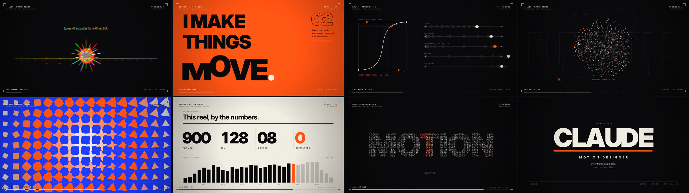
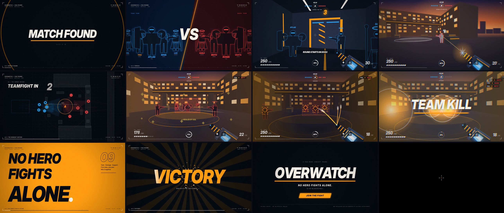

# CLAUDE — Motion Design Showreel 2026

**15秒 / 1920×1080 / 60fps / 128 BPM** — すべてのフレームをコードで書いたモーショングラフィックス・ショーリール。

▶ **[dist/showreel.mp4](dist/showreel.mp4)**



テンプレート・素材・プラグインは一切なし。映像も音も、時間 `t` を入力にとる純粋関数から生成しています。

## 構成 — 1小節 = 1シーン（8小節 × 1.875秒）

| # | 時間 | シーン | 見せているスキル |
|---|------|--------|------------------|
| 01 | 0:00 | **IGNITE** | 重力・バウンド・squash & stretch。点がタイムラインのルーラー上で拍に合わせて跳ね、予備動作のあと弾けて円ワイプへ |
| 02 | 0:01.9 | **KINETIC TYPE** | 「I MAKE / THINGS / MOVE.」のマスクリビール、フリップ、スラム。`MOVE.` の各文字がそれぞれ違う動きで性格を出す |
| 03 | 0:03.8 | **TIMING & EASING** | グラフエディタ上の `cubic-bezier(.83,0,.17,1)` と、5種のイージングで走るボールのオニオンスキン比較 |
| 04 | 0:05.6 | **DEPTH** | 900点の3D点群が 球 → トーラス → キューブ → 波打つフィールド へ拍ごとにモーフ。カメラがダイブして回転スクエアワイプ |
| 05 | 0:07.5 | **SYSTEMS** | 16×9グリッドの図形が、別々の原点から伝播する波で ○ → □ → △ → ✦ → ＋ に変形。タイルワイプで次へ |
| 06 | 0:09.4 | **DATA / UI** | このリール自身の数値（900 FRAMES / 128 BPM / 08 SCENES / 0 TEMPLATES）と、32拍のエネルギーマップ |
| 07 | 0:11.3 | **PARTICLES** | 約5,000粒の銀河が渦を巻き「MOTION」に収束 → 過去シーンのグリッチモンタージュ |
| 08 | 0:13.1 | **END** | タイトル。最後はブラウン管の電源オフのように線 → 点に収束し、冒頭の「点」に戻る |

### 細部へのこだわり
- **本物のモーションブラー** — 1フレームにつき8サブフレームを180°シャッターで合成
- **カメラ** — インパクトに応じたシェイクと色収差、キックに合わせたわずかなズームパルス
- **HUD** — タイムコード、フレーム番号、シーン名のスクランブル表示。文字色は下の背景の明度を読み取って自動で反転
- **トランジション** — 円ワイプ / バンドワイプ / ボールの合流 → 爆発 / 回転スクエア / タイル / バーの伸長 / グリッチ / CRTオフ。すべて前後のシーンの要素から繋がるマッチカット
- **サウンド** — `tools/soundtrack.py` で全音をシンセシス（F minor, 128 BPM）。キック、ベース、パッド、サイドチェイン、リバーブに加え、映像のイベント（バウンド、文字の着地、カウンター、モーフ、カット）すべてに同期したSFX。シーン03ではイージングカーブそのものを音程に変換して鳴らしています

## 再生・レンダリング

```bash
# ブラウザでリアルタイム再生（クリック / スペースで再生・停止）
python3 -m http.server 8000   # → http://localhost:8000/

# サウンドトラックを生成（numpy + scipy）
python3 tools/soundtrack.py

# 映像をレンダリング（Playwright + ffmpeg）→ dist/showreel.mp4
node tools/render.cjs --samples 8 --workers 4

# 任意の時刻の静止画
node tools/render.cjs --stills 1.5,3.2,12.6
```

## ファイル
- `src/reel.js` — アニメーション本体。`REEL.drawFrame(t, samples)` が時刻 `t` のフレームを描画する（状態を持たない）
- `index.html` — プレビュー用プレイヤー兼レンダリング用ホスト
- `tools/render.cjs` — ヘッドレスChromiumで各フレームを描画し、ffmpegへ直接パイプしてエンコード
- `tools/soundtrack.py` — サウンドトラックのシンセサイザー
- `dist/` — 完成した映像・音声・コンタクトシート

---

# OVERWATCH — ファンメイド・コンセプトプロモ（非公式）

**24秒 / 1920×1080 / 60fps / 120 BPM** — 上のショーリールと同じエンジン・同じテイストで作った、FPSゲーム「OVERWATCH」のプロモーション映像のコンセプト。

▶ **[dist/overwatch-promo.mp4](dist/overwatch-promo.mp4)**



> **非公式のファン作品です。** Blizzard Entertainment とは一切関係がなく、承認も受けていません。公式ロゴ・キャラクターデザイン・ヒーロー名・公式キャッチコピーは使用しておらず、ヒーローのシルエット、名前（ATLAS / NOVA / RONIN など）、ロールアイコン、武器、コピーはすべてオリジナルの代替表現です。

## 構成（1小節 = 2秒）

| # | 時間 | シーン | 内容 |
|---|------|--------|------|
| 01 | 0:00 | **MATCH FOUND** | 点がローディングリングになり、「MATCH FOUND」がスラム |
| 02 | 0:02 | **ROLES** | TANK ×1 / DAMAGE ×2 / SUPPORT ×2 のカードが拍ごとに着地 |
| 03 | 0:04 | **VERSUS** | 味方5人 vs 敵5人のラインナップ。**集団戦直前**の睨み合い |
| 04 | 0:06 | **SPAWN** 🎮 | **一人称視点**。スポーンルームで味方と並び、3・2・1カウントダウン → ドアが開く |
| 05 | 0:08 | **FIRST PICK** 🎮 | **一人称視点で射撃**。飛び降りてきた敵とカバー裏の敵を撃破（ヒットマーカー、ダメージ数値、キルフィード） |
| 06 | 0:10 | **THE MOMENT BEFORE** | 同じマップの戦術俯瞰図。両チームが配置につき「TEAMFIGHT IN 3・2・1」 — **集団戦直前** |
| 07 | 0:12 | **TEAMFIGHT** 🎮 | 「ENGAGE」。被弾 → 味方サポートの回復 → 撃ち返して撃破 → ULTIMATE READY |
| 08 | 0:14 | **ULTIMATE** 🎮 | スローモーションで4体をロックオン → 一斉射撃 → TEAM KILL |
| 09 | 0:16 | **NO HERO FIGHTS ALONE.** | キネティックタイポグラフィ |
| 10 | 0:18 | **VICTORY** | グリッチモンタージュ → VICTORY |
| 11 | 0:20 | **END** | タイトル、「JOIN THE FIGHT」、非公式表記。最後はCRTオフ → 点 → クロスヘアで締め |

🎮 = 一人称視点のゲームプレイシーン。軽量な自作3Dエンジン（Canvas 2D、ペインターズアルゴリズム、ニアクリップ、太陽光＋フォグ）で、スポーンルームからアリーナまで1つの連続したマップとしてレンダリングしています。

```bash
python3 tools/overwatch_soundtrack.py   # → dist/overwatch-soundtrack.wav
node tools/render.cjs --page overwatch.html --audio dist/overwatch-soundtrack.wav --out dist/overwatch-promo.mp4
python3 -m http.server 8000             # → http://localhost:8000/overwatch.html でリアルタイム再生
```

- `src/overwatch.js` — プロモ本体（3Dエンジン、HUD、全シーン）
- `tools/overwatch_soundtrack.py` — 銃声、カウントダウン、ドア、ロックオン、爆発まで含むサウンドトラック
- `tools/synth.py` — 2作品で共有できるシンセ部品
